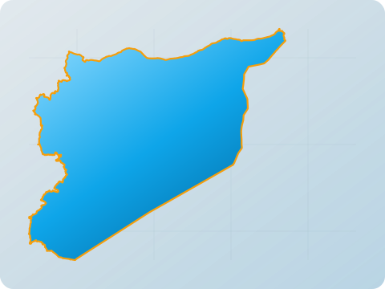

# Syria Humanitarian Data Package

Harmonised open geospatial data for Syria — documentation for the IHDP GeoPackage, produced under the H2H Fund.

**One reliable, standardised source for humanitarian GIS and information management in Syria.**

This site documents the **Syria Integrated Humanitarian Data Package (IHDP)** — a production GeoPackage that brings together harmonised vector and raster layers for coordination, analysis, and evidence-based decision-making.

- [Explore the documentation](#/layers/index)
- [Download package](https://drive.google.com/drive/folders/1bJQxwZ2kBYSXU3fW9nqT-1gT7KgXIlr_?usp=sharing)

## What this package is

Under the **H2H Fund**, partners are delivering a comprehensive humanitarian data package for Syria that consolidates key datasets from open sources, UN and coordination bodies, and civil-society organisations.

- **One package** — A single, reliable source of harmonised data instead of scattered files and inconsistent naming.
- **Ready for GIS & IM** — Structured metadata and documentation so datasets work across QGIS, ArcGIS, and information-management workflows.
- **Built for actors on the ground** — Local and national perspectives integrated to improve humanitarian coordination and decision-making.

The GeoPackage documented here (`syr_ihdp_s1_ma_hh_v-prod-01-20260519`) contains **30 vector layers** and **5 raster layers**, each with descriptions, technical metadata, schema samples, and map previews. Browse the [layer catalogue](#/layers/index) or read the [naming convention](#/reference/data-naming-convention) to understand how layers are structured.

## Part of a wider project

This data package sits within a broader **H2H Fund proposal** led by humanitarian data partners. Related workstreams include:

- Comprehensive Syria data package and harmonisation
- Standardised metadata and interoperability
- Local CSO data integration and feedback
- Harmonisation with ActivityInfo, KoBo, and reporting tools

This documentation site is the **accessible, offline-friendly catalogue** of what is inside the package — intended for data managers, GIS officers, and IM specialists who need to understand layers before downloading the full archive.

### Partners

  
  
  
  

<em>H2H Fund · Syria humanitarian data package</em>

