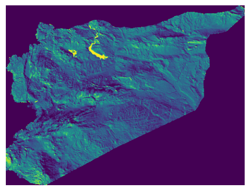

# syr_elev_hsh_ras_s1_srtm_pp_100m

Raster layer

**Type:** Raster

## Description

Hillshade. Source: Shuttle Radar Topography Mission 2014

## Preview

## Technical metadata

| Field | Value |
| --- | --- |
| Driver | GPKG |
| Dimensions | 7992 × 6011 px |
| Resolution | 0.000833 × 0.000833 |
| Bands | 1 |
| Band dtypes | uint8 |
| CRS | GEOGCS["Undefined geographic SRS",DATUM["unknown",SPHEROID["unknown",6378137,298.257223563]],PRIMEM["Greenwich",0],UNIT["degree",0.0174532925199433,AUTHORITY["EPSG","9122"]],AXIS["Latitude",NORTH],AXIS["Longitude",EAST]] |
| EPSG | 4326 |
| Bounds | 35.716666, 32.310834, 42.376666, 37.320000 |
| Layer name | syr_elev_hsh_ras_s1_srtm_pp_100m |
