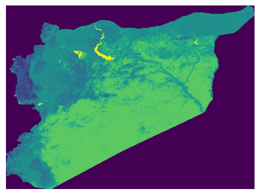

# syr_land_lnd_ras_s1_esa_pp_100m2021

Raster layer

**Type:** Raster

## Description

Landcover. Source: European Space Agency Worldcover 2021

## Preview

## Technical metadata

| Field | Value |
| --- | --- |
| Driver | GPKG |
| Dimensions | 8127 × 6004 px |
| Resolution | 0.000833 × 0.000833 |
| Bands | 1 |
| Band dtypes | float32 |
| CRS | GEOGCS["Undefined geographic SRS",DATUM["unknown",SPHEROID["unknown",6378137,298.257223563]],PRIMEM["Greenwich",0],UNIT["degree",0.0174532925199433,AUTHORITY["EPSG","9122"]],AXIS["Latitude",NORTH],AXIS["Longitude",EAST]] |
| EPSG | 4326 |
| Bounds | 35.613332, 32.315834, 42.385832, 37.319167 |
| Layer name | syr_land_lnd_ras_s1_esa_pp_100m2021 |
