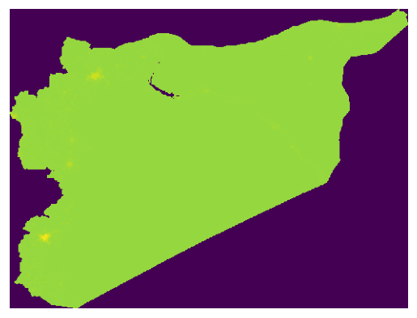

# syr_popu_den_ras_s1_wp_pp_1km2020ucunadj

Raster layer

**Type:** Raster

## Description

Population Density. Source: WorldPop 2020

## Preview

## Technical metadata

| Field | Value |
| --- | --- |
| Driver | GPKG |
| Dimensions | 800 × 601 px |
| Resolution | 0.008333 × 0.008333 |
| Bands | 1 |
| Band dtypes | float32 |
| CRS | GEOGCS["Undefined geographic SRS",DATUM["unknown",SPHEROID["unknown",6378137,298.257223563]],PRIMEM["Greenwich",0],UNIT["degree",0.0174532925199433,AUTHORITY["EPSG","9122"]],AXIS["Latitude",NORTH],AXIS["Longitude",EAST]] |
| EPSG | 4326 |
| Bounds | 35.715417, 32.316250, 42.382083, 37.324583 |
| Layer name | syr_popu_den_ras_s1_wp_pp_1km2020ucunadj |
