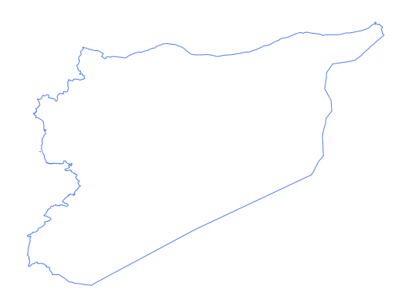

# syr_admn_ad0_ln_s1_UNCS_pp

Vector · LineString

**Geometry:** LineString

## Description

Country boundary. Source: United Nations Cartographic Section (UNCS) and partners via HDX Jan 2026

## Preview

## Technical metadata

| Field | Value |
| --- | --- |
| CRS | GEOGCS["WGS 84",DATUM["WGS_1984",SPHEROID["WGS 84",6378137,298.257223563,AUTHORITY["EPSG","7030"]],AUTHORITY["EPSG","6326"]],PRIMEM["Greenwich",0],UNIT["Degree",0.0174532925199433],AXIS["Longitude",EAST],AXIS["Latitude",NORTH]] |
| EPSG | — |
| Extent (minx, miny, maxx, maxy) | 35.613939, 32.316442, 42.385042, 37.319139 |
| Feature count | 2 |
| Layer name | syr_admn_ad0_ln_s1_UNCS_pp |

## Attribute schema

| Column | Type |
| --- | --- |
| LEFT_FID | int64 |
| RIGHT_FID | int64 |

## Sample data

| LEFT_FID | RIGHT_FID |
| --- | --- |
| -1 | 0 |
| -1 | 0 |
