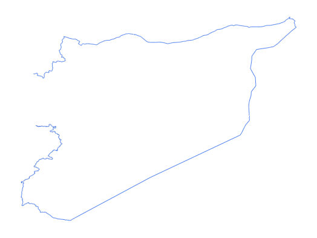

# syr_admn_ad0_ln_s1_UNCS_pp_land

Vector · LineString

**Geometry:** LineString

## Description

Country boundary. Source: United Nations Cartographic Section (UNCS) and partners via HDX Jan 2026

## Preview

## Technical metadata

| Field | Value |
| --- | --- |
| CRS | GEOGCS["WGS 84",DATUM["WGS_1984",SPHEROID["WGS 84",6378137,298.257223563,AUTHORITY["EPSG","7030"]],AUTHORITY["EPSG","6326"]],PRIMEM["Greenwich",0],UNIT["Degree",0.0174532925199433],AXIS["Longitude",EAST],AXIS["Latitude",NORTH]] |
| EPSG | — |
| Extent (minx, miny, maxx, maxy) | 35.921721, 35.918673, 35.935801, 35.930494 |
| Feature count | 4905 |
| Layer name | syr_admn_ad0_ln_s1_UNCS_pp_land |

## Attribute schema

| Column | Type |
| --- | --- |
| LEFT_FID | int64 |
| RIGHT_FID | int64 |
| ORIG_FID | int64 |
| ORIG_SEQ | int64 |

## Sample data

| LEFT_FID | RIGHT_FID | ORIG_FID | ORIG_SEQ |
| --- | --- | --- | --- |
| -1 | 0 | 1 | 179 |
| -1 | 0 | 1 | 180 |
| -1 | 0 | 1 | 181 |
| -1 | 0 | 1 | 182 |
| -1 | 0 | 1 | 183 |
