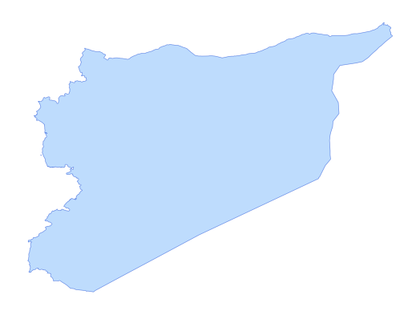

# syr_admn_ad0_py_s1_UNCS_pp

Vector · MultiPolygon

**Geometry:** MultiPolygon

## Description

Country boundary. Source: United Nations Cartographic Section (UNCS) and partners via HDX Jan 2026

## Preview

## Technical metadata

| Field | Value |
| --- | --- |
| CRS | GEOGCS["WGS 84",DATUM["WGS_1984",SPHEROID["WGS 84",6378137,298.257223563,AUTHORITY["EPSG","7030"]],AUTHORITY["EPSG","6326"]],PRIMEM["Greenwich",0],UNIT["Degree",0.0174532925199433],AXIS["Longitude",EAST],AXIS["Latitude",NORTH]] |
| EPSG | — |
| Extent (minx, miny, maxx, maxy) | 35.613939, 32.316442, 42.385042, 37.319139 |
| Feature count | 1 |
| Layer name | syr_admn_ad0_py_s1_UNCS_pp |

## Attribute schema

| Column | Type |
| --- | --- |
| ADM0_PCODE | str |
| ADM0_EN | str |
| ADM0_AR | str |
| validOn | str |
| validTo | object |
| ADM0_LABEL | str |
| area_km2 | float64 |

## Sample data

| ADM0_PCODE | ADM0_EN | ADM0_AR | validOn | validTo | ADM0_LABEL | area_km2 |
| --- | --- | --- | --- | --- | --- | --- |
| SY | Syrian Arab Republic | الجمهورية العربية السورية | 2020-12-17 |  | Syrian Arab Republic | 188561.6432069458 |
