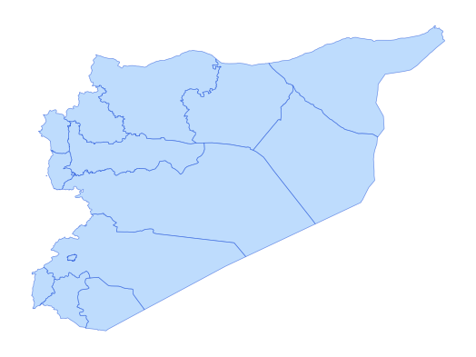

# syr_admn_ad1_py_s1_UNCS_pp

Vector · Polygon

**Geometry:** Polygon

## Description

Admin 1 boundary. Source: United Nations Cartographic Section (UNCS) and partners via HDX Jan 2026

## Preview

## Technical metadata

| Field | Value |
| --- | --- |
| CRS | GEOGCS["WGS 84",DATUM["WGS_1984",SPHEROID["WGS 84",6378137,298.257223563,AUTHORITY["EPSG","7030"]],AUTHORITY["EPSG","6326"]],PRIMEM["Greenwich",0],UNIT["Degree",0.0174532925199433],AXIS["Longitude",EAST],AXIS["Latitude",NORTH]] |
| EPSG | — |
| Extent (minx, miny, maxx, maxy) | 36.197150, 32.316442, 42.385042, 37.319139 |
| Feature count | 14 |
| Layer name | syr_admn_ad1_py_s1_UNCS_pp |

## Attribute schema

| Column | Type |
| --- | --- |
| ADM0_PCODE | str |
| ADM1_PCODE | str |
| ADM1_EN | str |
| ADM1_AR | str |
| validOn | str |
| validTo | object |
| ADM1_LABEL | str |
| area_km2 | float64 |

## Sample data

| ADM0_PCODE | ADM1_PCODE | ADM1_EN | ADM1_AR | validOn | validTo | ADM1_LABEL | area_km2 |
| --- | --- | --- | --- | --- | --- | --- | --- |
| SY | SY08 | Al-Hasakeh | الحسكة | 2020-12-17 |  | Al-Hasakeh | 23214.639639707377 |
| SY | SY02 | Aleppo | حلب | 2020-12-17 |  | Aleppo | 19931.570890546645 |
| SY | SY11 | Ar-Raqqa | الرقة | 2020-12-17 |  | Ar-Raqqa | 17663.71030857958 |
| SY | SY13 | As-Sweida | السويداء | 2020-12-17 |  | As-Sweida | 6375.525691162029 |
| SY | SY01 | Damascus | دمشق | 2020-12-17 |  | Damascus | 116.98589686818164 |
