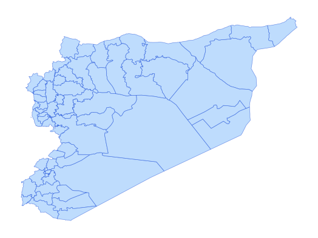

# syr_admn_ad2_py_s1_UNCS_pp

Vector · Polygon

**Geometry:** Polygon

## Description

Admin 2 boundary. Source: United Nations Cartographic Section (UNCS) and partners via HDX Jan 2026

## Preview

## Technical metadata

| Field | Value |
| --- | --- |
| CRS | GEOGCS["WGS 84",DATUM["WGS_1984",SPHEROID["WGS 84",6378137,298.257223563,AUTHORITY["EPSG","7030"]],AUTHORITY["EPSG","6326"]],PRIMEM["Greenwich",0],UNIT["Degree",0.0174532925199433],AXIS["Longitude",EAST],AXIS["Latitude",NORTH]] |
| EPSG | — |
| Extent (minx, miny, maxx, maxy) | 35.905484, 34.067998, 41.237749, 36.913492 |
| Feature count | 62 |
| Layer name | syr_admn_ad2_py_s1_UNCS_pp |

## Attribute schema

| Column | Type |
| --- | --- |
| ADM0_PCODE | str |
| ADM1_PCODE | str |
| ADM1_EN | str |
| ADM1_AR | str |
| ADM2_PCODE | str |
| ADM2_EN | str |
| ADM2_AR | str |
| validOn | str |
| validTo | object |
| ADM2_LABEL | str |
| area_km2 | float64 |

## Sample data

| ADM0_PCODE | ADM1_PCODE | ADM1_EN | ADM1_AR | ADM2_PCODE | ADM2_EN | ADM2_AR | validOn | validTo | ADM2_LABEL | area_km2 |
| --- | --- | --- | --- | --- | --- | --- | --- | --- | --- | --- |
| SY | SY02 | Aleppo | حلب | SY0204 | A'zaz | اعزاز | 2020-12-17 |  | A'zaz | 1262.4469374434875 |
| SY | SY09 | Deir-ez-Zor | دير الزور | SY0902 | Abu Kamal | البوكمال | 2020-12-17 |  | Abu Kamal | 6827.507172772772 |
| SY | SY02 | Aleppo | حلب | SY0203 | Afrin | عفرين | 2020-12-17 |  | Afrin | 1844.459119688311 |
| SY | SY02 | Aleppo | حلب | SY0206 | Ain Al Arab | عين العرب | 2020-12-17 |  | Ain Al Arab | 3074.0425267268315 |
| SY | SY06 | Lattakia | اللاذقية | SY0603 | Al-Haffa | الحفة | 2020-12-17 |  | Al-Haffa | 571.04514919006 |
