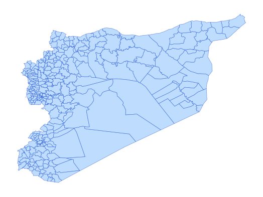

# syr_admn_ad3_py_s1_UNCS_pp

Vector · Polygon

**Geometry:** Polygon

## Description

Admin 3 boundary. Source: United Nations Cartographic Section (UNCS) and partners via HDX Jan 2026

## Preview

## Technical metadata

| Field | Value |
| --- | --- |
| CRS | GEOGCS["WGS 84",DATUM["WGS_1984",SPHEROID["WGS 84",6378137,298.257223563,AUTHORITY["EPSG","7030"]],AUTHORITY["EPSG","6326"]],PRIMEM["Greenwich",0],UNIT["Degree",0.0174532925199433],AXIS["Longitude",EAST],AXIS["Latitude",NORTH]] |
| EPSG | — |
| Extent (minx, miny, maxx, maxy) | 36.900416, 34.067998, 40.997652, 36.663416 |
| Feature count | 272 |
| Layer name | syr_admn_ad3_py_s1_UNCS_pp |

## Attribute schema

| Column | Type |
| --- | --- |
| ADM0_PCODE | str |
| ADM1_PCODE | str |
| ADM1_EN | str |
| ADM1_AR | str |
| ADM2_PCODE | str |
| ADM2_EN | str |
| ADM2_AR | str |
| ADM3_PCODE | str |
| ADM3_EN | str |
| ADM3_AR | str |
| validOn | str |
| validTo | object |
| ADM3_LABEL | str |
| area_km2 | float64 |

## Sample data

| ADM0_PCODE | ADM1_PCODE | ADM1_EN | ADM1_AR | ADM2_PCODE | ADM2_EN | ADM2_AR | ADM3_PCODE | ADM3_EN | ADM3_AR | validOn | validTo |
| --- | --- | --- | --- | --- | --- | --- | --- | --- | --- | --- | --- |
| SY | SY02 | Aleppo | حلب | SY0202 | Al Bab | الباب | SY020206 | A'rima | عريمة | 2020-12-17 |  |
| SY | SY02 | Aleppo | حلب | SY0204 | A'zaz | اعزاز | SY020400 | A'zaz | مركز اعزاز | 2020-12-17 |  |
| SY | SY09 | Deir-ez-Zor | دير الزور | SY0902 | Abu Kamal | البوكمال | SY090200 | Abu Kamal | مركز البوكمال | 2020-12-17 |  |
| SY | SY02 | Aleppo | حلب | SY0205 | Menbij | منبج | SY020501 | Abu Qalqal | أبو قلقل | 2020-12-17 |  |
| SY | SY07 | Idleb | إدلب | SY0700 | Idleb | مركز إدلب | SY070001 | Abul Thohur | أبو الظهور | 2020-12-17 |  |
