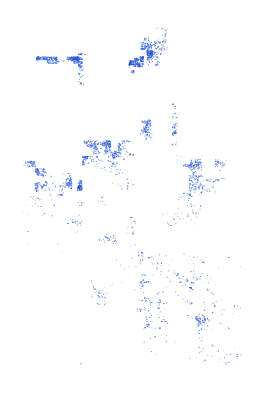

# syr_bldg_bdg_py_s3_osm_pp

Vector · Polygon

**Geometry:** Polygon

## Description

Building. Source: OpenStreetMap May 2026

## Preview

## Technical metadata

| Field | Value |
| --- | --- |
| CRS | GEOGCS["WGS 84",DATUM["WGS_1984",SPHEROID["WGS 84",6378137,298.257223563]],PRIMEM["Greenwich",0],UNIT["degree",0.0174532925199433],AXIS["Longitude",EAST],AXIS["Latitude",NORTH]] |
| EPSG | — |
| Extent (minx, miny, maxx, maxy) | 37.219274, 36.175669, 37.222002, 36.176789 |
| Feature count | 1263817 |
| Layer name | syr_bldg_bdg_py_s3_osm_pp |

## Attribute schema

| Column | Type |
| --- | --- |
| osm_id | int64 |
| category | str |
| fclass | str |

## Sample data

| osm_id | category | fclass |
| --- | --- | --- |
| 1145544983 | yes | yes |
| 1142117493 | yes | yes |
| 1156886387 | yes | yes |
| 1143435295 | yes | yes |
| 1142117466 | yes | yes |
