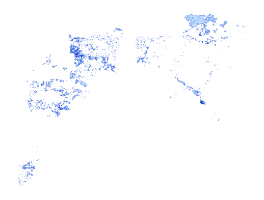

# syr_land_lnd_py_s3_osm_pp

Vector · Polygon

**Geometry:** Polygon

## Description

Land use. Source: OpenStreetMap May 2026

## Preview

## Technical metadata

| Field | Value |
| --- | --- |
| CRS | GEOGCS["WGS 84",DATUM["WGS_1984",SPHEROID["WGS 84",6378137,298.257223563]],PRIMEM["Greenwich",0],UNIT["degree",0.0174532925199433],AXIS["Longitude",EAST],AXIS["Latitude",NORTH]] |
| EPSG | — |
| Extent (minx, miny, maxx, maxy) | 37.134570, 36.145281, 37.170248, 36.167606 |
| Feature count | 55312 |
| Layer name | syr_land_lnd_py_s3_osm_pp |

## Attribute schema

| Column | Type |
| --- | --- |
| osm_id | int64 |
| category | str |
| fclass | str |

## Sample data

| osm_id | category | fclass |
| --- | --- | --- |
| 446604403 | developed | industrial |
| 1148232391 | developed | landfill |
| 505424222 | agriculture | farmland |
| 446338624 | agriculture | orchard |
| 446338631 | agriculture | orchard |
