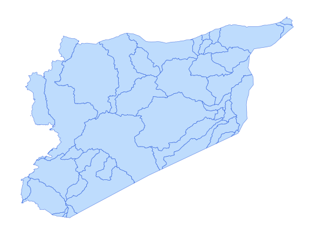

# syr_phys_bsn_py_s1_hydrobasin_pp_lev06

Vector · MultiPolygon, Polygon

**Geometry:** MultiPolygon, Polygon

## Description

Watersheds. Source: HydroBASINS 2024

## Preview

## Technical metadata

| Field | Value |
| --- | --- |
| CRS | GEOGCS["WGS 84",DATUM["WGS_1984",SPHEROID["WGS 84",6378137,298.257223563,AUTHORITY["EPSG","7030"]],AUTHORITY["EPSG","6326"]],PRIMEM["Greenwich",0],UNIT["Degree",0.0174532925199433],AXIS["Longitude",EAST],AXIS["Latitude",NORTH]] |
| EPSG | — |
| Extent (minx, miny, maxx, maxy) | 35.613939, 32.343365, 37.529167, 36.845602 |
| Feature count | 42 |
| Layer name | syr_phys_bsn_py_s1_hydrobasin_pp_lev06 |

## Attribute schema

| Column | Type |
| --- | --- |
| id | int64 |
| objectid | int64 |
| hybas_id | float64 |

## Sample data

| id | objectid | hybas_id |
| --- | --- | --- |
| 3604.0 | 3604.0 | 2060000360.0 |
| 3605.0 | 3605.0 | 2060001220.0 |
| 5582.0 | 5582.0 | 2060784930.0 |
| 5581.0 | 5581.0 | 2060795060.0 |
| 5583.0 | 5583.0 | 2060784870.0 |
