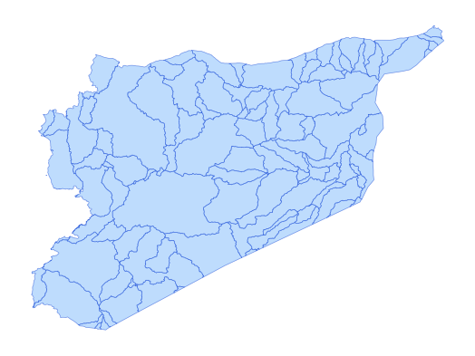

# syr_phys_bsn_py_s1_hydrobasin_pp_lev07

Vector · MultiPolygon, Polygon

**Geometry:** MultiPolygon, Polygon

## Description

Watersheds. Source: HydroBASINS 2024

## Preview

## Technical metadata

| Field | Value |
| --- | --- |
| CRS | GEOGCS["WGS 84",DATUM["WGS_1984",SPHEROID["WGS 84",6378137,298.257223563,AUTHORITY["EPSG","7030"]],AUTHORITY["EPSG","6326"]],PRIMEM["Greenwich",0],UNIT["Degree",0.0174532925199433],AXIS["Longitude",EAST],AXIS["Latitude",NORTH]] |
| EPSG | — |
| Extent (minx, miny, maxx, maxy) | 36.401933, 35.829728, 39.046451, 36.913492 |
| Feature count | 109 |
| Layer name | syr_phys_bsn_py_s1_hydrobasin_pp_lev07 |

## Attribute schema

| Column | Type |
| --- | --- |
| id | int64 |
| objectid | int64 |
| hybas_id | float64 |

## Sample data

| id | objectid | hybas_id |
| --- | --- | --- |
| 12371.0 | 12371.0 | 2070718760.0 |
| 17786.0 | 17786.0 | 2070718300.0 |
| 17801.0 | 17801.0 | 2070725880.0 |
| 17822.0 | 17822.0 | 2070712490.0 |
| 17823.0 | 17823.0 | 2070712770.0 |
