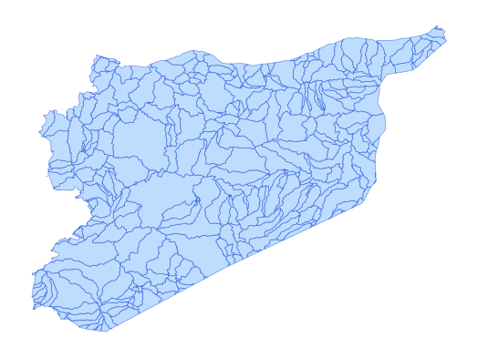

# syr_phys_bsn_py_s1_hydrobasin_pp_lev08

Vector · Polygon

**Geometry:** Polygon

## Description

Watersheds. Source: HydroBASINS 2024

## Preview

## Technical metadata

| Field | Value |
| --- | --- |
| CRS | GEOGCS["WGS 84",DATUM["WGS_1984",SPHEROID["WGS 84",6378137,298.257223563,AUTHORITY["EPSG","7030"]],AUTHORITY["EPSG","6326"]],PRIMEM["Greenwich",0],UNIT["Degree",0.0174532925199433],AXIS["Longitude",EAST],AXIS["Latitude",NORTH]] |
| EPSG | — |
| Extent (minx, miny, maxx, maxy) | 35.613939, 32.348019, 36.800000, 33.179167 |
| Feature count | 324 |
| Layer name | syr_phys_bsn_py_s1_hydrobasin_pp_lev08 |

## Attribute schema

| Column | Type |
| --- | --- |
| id | int64 |
| objectid | int64 |
| hybas_id | float64 |

## Sample data

| id | objectid | hybas_id |
| --- | --- | --- |
| 63566.0 | 63566.0 | 2080784930.0 |
| 63567.0 | 63567.0 | 2080784870.0 |
| 63577.0 | 63577.0 | 2080780020.0 |
| 63580.0 | 63580.0 | 2080782350.0 |
| 63582.0 | 63582.0 | 2080794380.0 |
