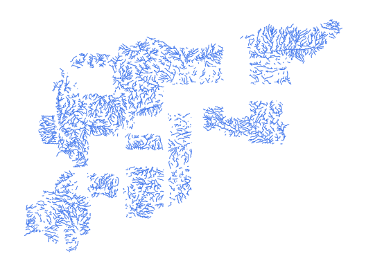

# syr_phys_riv_ln_s3_hydrorivers_pp

Vector · LineString

**Geometry:** LineString

## Description

Rivers. Source: HydroRIVERS 2024

## Preview

## Technical metadata

| Field | Value |
| --- | --- |
| CRS | GEOGCS["WGS 84",DATUM["WGS_1984",SPHEROID["WGS 84",6378137,298.257223563,AUTHORITY["EPSG","7030"]],AUTHORITY["EPSG","6326"]],PRIMEM["Greenwich",0],UNIT["Degree",0.0174532925199433],AXIS["Longitude",EAST],AXIS["Latitude",NORTH]] |
| EPSG | — |
| Extent (minx, miny, maxx, maxy) | 37.987500, 36.300000, 38.668750, 36.456250 |
| Feature count | 9212 |
| Layer name | syr_phys_riv_ln_s3_hydrorivers_pp |

## Attribute schema

| Column | Type |
| --- | --- |
| id | int64 |
| hyriv_id | int64 |
| next_down | int64 |
| main_riv | int64 |
| length_km | float64 |
| dist_dn_km | float64 |
| dist_up_km | float64 |
| catch_skm | float64 |
| upland_skm | float64 |
| endorheic | int64 |
| dis_av_cms | float64 |
| ord_stra | int64 |
| ord_clas | int64 |
| ord_flow | int64 |
| hybas_l12 | int64 |

## Sample data

| id | hyriv_id | next_down | main_riv | length_km | dist_dn_km | dist_up_km | catch_skm | upland_skm | endorheic | dis_av_cms | ord_stra |
| --- | --- | --- | --- | --- | --- | --- | --- | --- | --- | --- | --- |
| 2216241.0 | 20688690.0 | 20688862.0 | 20791150.0 | 0.89 | 1810.1 | 6.8 | 10.38 | 10.4 | 0.0 | 0.007 | 1.0 |
| 2214039.0 | 20686488.0 | 20686718.0 | 20791150.0 | 1.06 | 1827.2 | 1222.3 | 0.69 | 106019.2 | 0.0 | 731.548 | 7.0 |
| 2214182.0 | 20686631.0 | 20686718.0 | 20791150.0 | 1.53 | 1827.0 | 8.0 | 11.57 | 11.6 | 0.0 | 0.009 | 1.0 |
| 2214184.0 | 20686633.0 | 20687156.0 | 20791150.0 | 2.61 | 1762.6 | 27.2 | 4.83 | 184.5 | 0.0 | 0.044 | 2.0 |
| 2214265.0 | 20686714.0 | 20687028.0 | 20791150.0 | 5.19 | 1839.0 | 9.7 | 20.9 | 20.9 | 0.0 | 0.005 | 1.0 |
