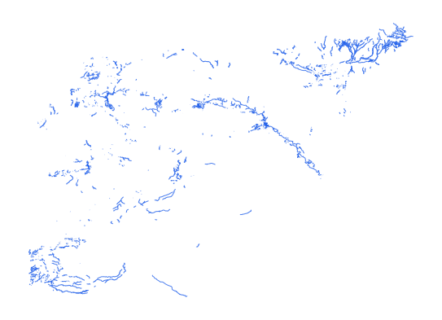

# syr_phys_riv_ln_s3_osm_pp

Vector · LineString

**Geometry:** LineString

## Description

Rivers and streams. Source: OpenStreetMap May 2026

## Preview

## Technical metadata

| Field | Value |
| --- | --- |
| CRS | GEOGCS["WGS 84",DATUM["WGS_1984",SPHEROID["WGS 84",6378137,298.257223563]],PRIMEM["Greenwich",0],UNIT["degree",0.0174532925199433],AXIS["Longitude",EAST],AXIS["Latitude",NORTH]] |
| EPSG | — |
| Extent (minx, miny, maxx, maxy) | 38.850743, 36.391411, 40.062260, 36.840107 |
| Feature count | 12831 |
| Layer name | syr_phys_riv_ln_s3_osm_pp |

## Attribute schema

| Column | Type |
| --- | --- |
| osm_id | int64 |
| category | str |
| fclass | str |
| name | str |
| name_en | str |
| name_ar | str |

## Sample data

| osm_id | category | fclass | name | name_en | name_ar |
| --- | --- | --- | --- | --- | --- |
| 936571988 | river | river | نهر الخابور | Khabur River | نهر الخابور |
| 853605237 | artificial | drain |  |  |  |
| 129423530 | river | stream | اليريلي كريك | Khabur River | اليريلي كريك |
| 1167487836 | artificial | ditch |  |  |  |
| 1167487831 | artificial | ditch |  |  |  |
