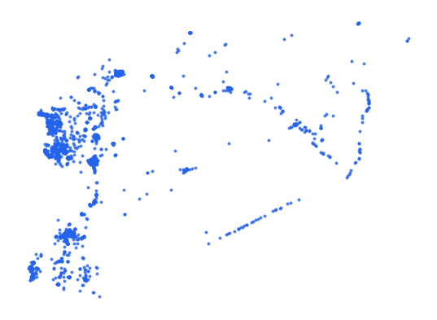

# syr_pois_srv_pt_s3_osm_pp

Vector · Point

**Geometry:** Point

## Description

Service points of interest. Source: OpenStreetMap May 2026

## Preview

## Technical metadata

| Field | Value |
| --- | --- |
| CRS | GEOGCS["WGS 84",DATUM["WGS_1984",SPHEROID["WGS 84",6378137,298.257223563]],PRIMEM["Greenwich",0],UNIT["degree",0.0174532925199433],AXIS["Longitude",EAST],AXIS["Latitude",NORTH]] |
| EPSG | — |
| Extent (minx, miny, maxx, maxy) | 36.045724, 32.859157, 36.482196, 33.498019 |
| Feature count | 9415 |
| Layer name | syr_pois_srv_pt_s3_osm_pp |

## Attribute schema

| Column | Type |
| --- | --- |
| osm_id | int64 |
| category | str |
| fclass | str |
| name | str |
| name_en | str |
| name_ar | object |
| operator | object |

## Sample data

| osm_id | category | fclass | name | name_en | name_ar | operator |
| --- | --- | --- | --- | --- | --- | --- |
| 1289830961 | sustenance | restaurant | مطعم مغارة عريقة | Ariqa Cave |  |  |
| 1825151856 | transport | fuel |  |  |  |  |
| 1151892294 | health | hospital | مستشفى نوى الوطني | Nawa National Hospital |  |  |
| 13397214001 | health | clinic | مشفى إزرع الوطني |  |  |  |
| 7040185785 | health | pharmacy | صيدلية الخالد |  |  |  |
