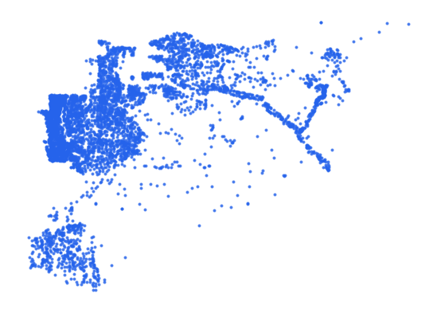

# syr_stle_stl_pt_s3_osm_pp

Vector · Point

**Geometry:** Point

## Description

Urban and rural settlement. Source: OpenStreetMap May 2026

## Preview

## Technical metadata

| Field | Value |
| --- | --- |
| CRS | GEOGCS["WGS 84",DATUM["WGS_1984",SPHEROID["WGS 84",6378137,298.257223563]],PRIMEM["Greenwich",0],UNIT["degree",0.0174532925199433],AXIS["Longitude",EAST],AXIS["Latitude",NORTH]] |
| EPSG | — |
| Extent (minx, miny, maxx, maxy) | 36.260964, 32.872484, 36.740602, 32.905979 |
| Feature count | 8955 |
| Layer name | syr_stle_stl_pt_s3_osm_pp |

## Attribute schema

| Column | Type |
| --- | --- |
| osm_id | int64 |
| category | str |
| fclass | str |
| name | str |
| name_en | str |
| name_ar | str |
| capital | object |
| population | str |

## Sample data

| osm_id | category | fclass | name | name_en | name_ar | capital | population |
| --- | --- | --- | --- | --- | --- | --- | --- |
| 573516051 | rural | village | أم الزيتون | Umm az-Zaitun | أم الزيتون |  | 1913 |
| 573514543 | rural | village | الجنينة | Al-Jeneina | الجنينة |  | 2580 |
| 573515958 | urban | town | شقا | Shaqqa | شقا |  | 5116 |
| 573514156 | rural | village | صلاخد | Salakhed | صلاخد |  | 950 |
| 12232172771 | rural | hamlet | الوراد | Al-Werad | الوراد |  | 250 |
