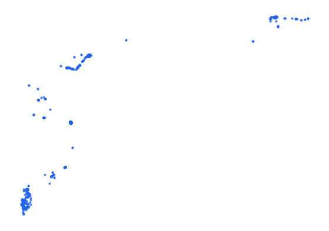

# syr_telc_tel_pt_s3_opencellid_pp

Vector · Point

**Geometry:** Point

## Description

Cell Towers. Source: OpenCellID Apr 2026

## Preview

## Technical metadata

| Field | Value |
| --- | --- |
| CRS | GEOGCS["WGS 84",DATUM["WGS_1984",SPHEROID["WGS 84",6378137,298.257223563,AUTHORITY["EPSG","7030"]],AUTHORITY["EPSG","6326"]],PRIMEM["Greenwich",0],UNIT["Degree",0.0174532925199433],AXIS["Longitude",EAST],AXIS["Latitude",NORTH]] |
| EPSG | — |
| Extent (minx, miny, maxx, maxy) | 41.211800, 37.004000, 41.712300, 37.049300 |
| Feature count | 898 |
| Layer name | syr_telc_tel_pt_s3_opencellid_pp |

## Attribute schema

| Column | Type |
| --- | --- |
| id | int64 |
| radio | str |
| mcc | int64 |
| net | int64 |
| area | int64 |
| cell | int64 |
| unit | int64 |
| range | int64 |
| samples | int64 |
| changeable | bool |
| averagesig | bool |

## Sample data

| id | radio | mcc | net | area | cell | unit | range | samples | changeable | averagesig |
| --- | --- | --- | --- | --- | --- | --- | --- | --- | --- | --- |
| 2540486 | UMTS | 417 | 1 | 52602 | 50496753 | 0 | 4319 | 4 | True | False |
| 2540487 | UMTS | 417 | 1 | 52602 | 50506753 | 0 | 1000 | 3 | True | False |
| 2540489 | UMTS | 417 | 1 | 52602 | 50496751 | 0 | 1000 | 2 | True | False |
| 2540492 | UMTS | 417 | 1 | 52602 | 50506399 | 0 | 1000 | 4 | True | False |
| 2540494 | UMTS | 417 | 1 | 52602 | 50496486 | 0 | 1000 | 4 | True | False |
