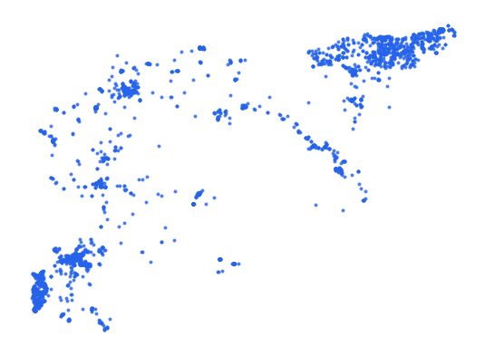

# syr_tran_gat_pt_s3_osm_pp

Vector · Point

**Geometry:** Point

## Description

Transport barrier. Source: OpenStreetMap May 2026

## Preview

## Technical metadata

| Field | Value |
| --- | --- |
| CRS | GEOGCS["WGS 84",DATUM["WGS_1984",SPHEROID["WGS 84",6378137,298.257223563]],PRIMEM["Greenwich",0],UNIT["degree",0.0174532925199433],AXIS["Longitude",EAST],AXIS["Latitude",NORTH]] |
| EPSG | — |
| Extent (minx, miny, maxx, maxy) | 36.058706, 32.837123, 36.297204, 33.522145 |
| Feature count | 2954 |
| Layer name | syr_tran_gat_pt_s3_osm_pp |

## Attribute schema

| Column | Type |
| --- | --- |
| osm_id | int64 |
| category | str |
| fclass | str |

## Sample data

| osm_id | category | fclass |
| --- | --- | --- |
| 1791679625 | gate | gate |
| 5633608661 | gate | gate |
| 5423839155 | vehicle_barrier | block |
| 3136832791 | gate | gate |
| 3136787989 | gate | gate |
