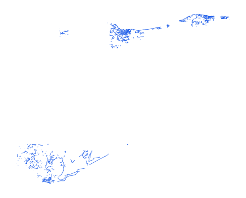

# syr_tran_rds_ln_s3_osm_pp

Vector · LineString

**Geometry:** LineString

## Description

Roads. Source: OpenStreetMap May 2026

## Preview

## Technical metadata

| Field | Value |
| --- | --- |
| CRS | GEOGCS["WGS 84",DATUM["WGS_1984",SPHEROID["WGS 84",6378137,298.257223563]],PRIMEM["Greenwich",0],UNIT["degree",0.0174532925199433],AXIS["Longitude",EAST],AXIS["Latitude",NORTH]] |
| EPSG | — |
| Extent (minx, miny, maxx, maxy) | 40.937252, 36.820864, 41.143204, 36.979650 |
| Feature count | 330785 |
| Layer name | syr_tran_rds_ln_s3_osm_pp |

## Attribute schema

| Column | Type |
| --- | --- |
| osm_id | int64 |
| category | str |
| fclass | str |
| name | object |
| name_en | object |
| name_ar | object |
| bridge | object |
| tunnel | object |
| ref | object |

## Sample data

| osm_id | category | fclass | name | name_en | name_ar | bridge | tunnel | ref |
| --- | --- | --- | --- | --- | --- | --- | --- | --- |
| 1482352979 | unclassified | unclassified |  |  |  |  |  |  |
| 1482352981 | unclassified | unclassified |  |  |  |  |  |  |
| 1482530420 | unclassified | unclassified |  |  |  |  |  |  |
| 371877158 | unclassified | unclassified |  |  |  |  |  |  |
| 1086282444 | unclassified | unclassified |  |  |  |  |  |  |
