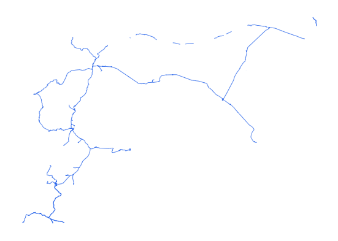

# syr_tran_rrd_ln_s3_osm_pp

Vector · LineString

**Geometry:** LineString

## Description

Railway. Source: OpenStreetMap May 2026

## Preview

## Technical metadata

| Field | Value |
| --- | --- |
| CRS | GEOGCS["WGS 84",DATUM["WGS_1984",SPHEROID["WGS 84",6378137,298.257223563]],PRIMEM["Greenwich",0],UNIT["degree",0.0174532925199433],AXIS["Longitude",EAST],AXIS["Latitude",NORTH]] |
| EPSG | — |
| Extent (minx, miny, maxx, maxy) | 36.103498, 32.628304, 41.256420, 37.072688 |
| Feature count | 2023 |
| Layer name | syr_tran_rrd_ln_s3_osm_pp |

## Attribute schema

| Column | Type |
| --- | --- |
| osm_id | int64 |
| category | str |
| fclass | str |
| name | str |
| name_en | str |
| name_ar | str |
| bridge | object |
| tunnel | object |
| ref | object |

## Sample data

| osm_id | category | fclass | name | name_en | name_ar | bridge | tunnel | ref |
| --- | --- | --- | --- | --- | --- | --- | --- | --- |
| 142924966 | railway | rail |  |  |  |  |  |  |
| -1277794 | railway | abandoned | سكة حديد الحجاز | Hejaz Railway | سكة حديد الحجاز |  |  |  |
| 143126686 | railway | disused |  |  |  |  |  |  |
| 1348971120 | railway | disused |  |  |  |  |  |  |
| 123407215 | railway | rail |  |  |  |  |  |  |
