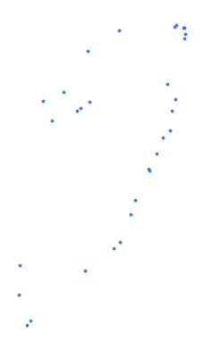

# syr_tran_sea_pt_s1_wpi_pp

Vector · Point

**Geometry:** Point

## Description

Sea ports. Source: World Port Index May 2026

## Preview

## Technical metadata

| Field | Value |
| --- | --- |
| CRS | GEOGCS["WGS 84",DATUM["WGS_1984",SPHEROID["WGS 84",6378137,298.257223563,AUTHORITY["EPSG","7030"]],AUTHORITY["EPSG","6326"]],PRIMEM["Greenwich",0],UNIT["Degree",0.0174532925199433],AXIS["Longitude",EAST],AXIS["Latitude",NORTH]] |
| EPSG | — |
| Extent (minx, miny, maxx, maxy) | 32.466667, 29.866667, 36.166667, 36.916667 |
| Feature count | 31 |
| Layer name | syr_tran_sea_pt_s1_wpi_pp |

## Attribute schema

| Column | Type |
| --- | --- |
| OID_ | float64 |
| World Port | float64 |
| Region Nam | str |
| Main Port | str |
| Alternate | str |
| UN/LOCODE | str |
| Country Co | str |
| World Wate | str |
| IHO S-130 | object |
| Sailing Di | str |
| Publicatio | str |
| Standard N | str |
| IHO S-57 E | object |
| IHO S-101 | object |
| Digital Na | str |
| Tidal Rang | float64 |
| Entrance W | float64 |
| Channel De | float64 |
| Anchorage | float64 |
| Cargo Pier | float64 |
| Oil Termin | float64 |
| Liquified | float64 |
| Maximum Ve | float64 |
| Maximum _1 | float64 |
| Maximum _2 | float64 |
| Offshore M | float64 |
| Offshore_1 | float64 |
| Offshore_2 | float64 |
| Harbor Siz | str |
| Harbor Typ | str |
| Harbor Use | str |
| Shelter Af | str |
| Entrance R | str |
| Entrance_1 | str |
| Entrance_2 | str |
| Entrance_3 | str |
| Overhead L | str |
| Underkeel | str |
| Good Holdi | str |
| Turning Ar | str |
| Port Secur | str |
| Estimated | str |
| Quarantine | str |
| Quaranti_1 | str |
| Quaranti_2 | str |
| Traffic Se | str |
| Vessel Tra | str |
| First Port | str |
| US Represe | str |
| Pilotage - | str |
| Pilotage_1 | str |
| Pilotage_2 | str |
| Pilotage_3 | str |
| Tugs - Sal | str |
| Tugs - Ass | str |
| Communicat | str |
| Communic_1 | str |
| Communic_2 | str |
| Communic_3 | str |
| Communic_4 | str |
| Communic_5 | str |
| Search and | str |
| NAVAREA | str |
| Facilities | str |
| Faciliti_1 | str |
| Faciliti_2 | str |
| Faciliti_3 | str |
| Faciliti_4 | str |
| Faciliti_5 | str |
| Faciliti_6 | str |
| Faciliti_7 | str |
| Faciliti_8 | str |
| Faciliti_9 | str |
| Faciliti10 | str |
| Faciliti11 | str |
| Faciliti12 | str |
| Faciliti13 | str |
| Medical Fa | str |
| Garbage Di | str |
| Chemical H | str |
| Degaussing | str |
| Dirty Ball | str |
| Cranes - F | str |
| Cranes - M | str |
| Cranes -_1 | str |
| Cranes Con | str |
| Lifts - 10 | str |
| Lifts - 50 | str |
| Lifts - 25 | str |
| Lifts - 0- | str |
| Services - | str |
| Services_1 | str |
| Services_2 | str |
| Services_3 | str |
| Services_4 | str |
| Services_5 | str |
| Services_6 | str |
| Supplies - | str |
| Supplies_1 | str |
| Supplies_2 | str |
| Supplies_3 | str |
| Supplies_4 | str |
| Supplies_5 | str |
| Supplies_6 | str |
| Repairs | str |
| Dry Dock | str |
| Railway | str |
| Latitude | float64 |
| Longitude | float64 |

## Sample data

| OID_ | World Port | Region Nam | Main Port | Alternate | UN/LOCODE | Country Co | World Wate | IHO S-130 | Sailing Di | Publicatio | Standard N |
| --- | --- | --- | --- | --- | --- | --- | --- | --- | --- | --- | --- |
| 4.0 | 44804.0 | Turkey Asia -- 44360 | Delta Terminal |  |  | Turkey | Mediterranean Sea; North Atlantic Ocean |  | Sailing Directions Pub. 132 (Enroute) - Eastern Mediterranean | https://msi.geo.nga.mil/api/publications/download?key=16694491/SFH00000/Pub132bk.pdf&type=view | 54481.0 |
| 812.0 | 44802.0 | Turkey Asia -- 44360 | Botas Dortyol Oil Terminal |  | TR BOT | Turkey | Mediterranean Sea; North Atlantic Ocean |  | Sailing Directions Pub. 132 (Enroute) - Eastern Mediterranean | https://msi.geo.nga.mil/api/publications/download?key=16694491/SFH00000/Pub132bk.pdf&type=view | 54481.0 |
| 406.0 | 44870.0 | Turkey Asia -- 44360 | Botas |  | TR BOT | Turkey | Mediterranean Sea; North Atlantic Ocean |  | Sailing Directions Pub. 132 (Enroute) - Eastern Mediterranean | https://msi.geo.nga.mil/api/publications/download?key=16694491/SFH00000/Pub132bk.pdf&type=view | 54481.0 |
| 442.0 | 44801.0 | Turkey Asia -- 44360 | Toros Gubre |  | TR TGT | Turkey | Mediterranean Sea; North Atlantic Ocean |  | Sailing Directions Pub. 132 (Enroute) - Eastern Mediterranean | https://msi.geo.nga.mil/api/publications/download?key=16694491/SFH00000/Pub132bk.pdf&type=view | 54481.0 |
| 1243.0 | 48045.0 | Egypt Red Sea -- 47950 | El-Adabiya | Al-Adabiyah | EG ADA | Egypt | Gulf of Suez; Red Sea; Indian Ocean |  | Sailing Directions Pub. 172 (Enroute) - Red Sea and the Persian Gulf | https://msi.geo.nga.mil/api/publications/download?key=16694491/SFH00000/Pub172bk.pdf&type=view | 62193.0 |
