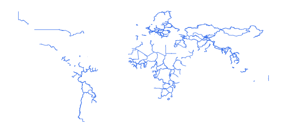

# wrl_admn_ad0_ln_s0_un_pp

Vector · LineString

**Geometry:** LineString

## Description

World country boundary. Source: United Nations 2019

## Preview

## Technical metadata

| Field | Value |
| --- | --- |
| CRS | GEOGCS["WGS 84",DATUM["WGS_1984",SPHEROID["WGS 84",6378137,298.257223563,AUTHORITY["EPSG","7030"]],AUTHORITY["EPSG","6326"]],PRIMEM["Greenwich",0],UNIT["Degree",0.0174532925199433],AXIS["Longitude",EAST],AXIS["Latitude",NORTH]] |
| EPSG | — |
| Extent (minx, miny, maxx, maxy) | 60.517603, 29.377200, 74.889862, 38.489592 |
| Feature count | 327 |
| Layer name | wrl_admn_ad0_ln_s0_un_pp |

## Attribute schema

| Column | Type |
| --- | --- |
| BDYTYP | int64 |
| ISO3CD | str |
| Shape_Leng | float64 |
| Shape__Len | float64 |

## Sample data

| BDYTYP | ISO3CD | Shape_Leng | Shape__Len |
| --- | --- | --- | --- |
| 1 | AFG_CHN | 0.929954881105 | 114447.016109 |
| 1 | AFG_IRN | 8.87774049196 | 1094084.34076 |
| 1 | AFG_PAK | 26.127776686 | 3105435.31264 |
| 1 | AFG_TJK | 13.8837353554 | 1714206.68136 |
| 1 | AFG_TKM | 8.10704915283 | 980906.653465 |
