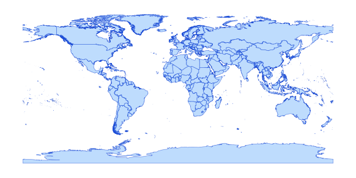

# wrl_admn_ad0_py_s0_un_pp

Vector · MultiPolygon, Polygon

**Geometry:** MultiPolygon, Polygon

## Description

World country boundary. Source: United Nations 2019

## Preview

## Technical metadata

| Field | Value |
| --- | --- |
| CRS | GEOGCS["WGS 84",DATUM["WGS_1984",SPHEROID["WGS 84",6378137,298.257223563,AUTHORITY["EPSG","7030"]],AUTHORITY["EPSG","6326"]],PRIMEM["Greenwich",0],UNIT["Degree",0.0174532925199433],AXIS["Longitude",EAST],AXIS["Latitude",NORTH]] |
| EPSG | — |
| Extent (minx, miny, maxx, maxy) | -70.064313, -18.038312, 74.889862, 60.462326 |
| Feature count | 291 |
| Layer name | wrl_admn_ad0_py_s0_un_pp |

## Attribute schema

| Column | Type |
| --- | --- |
| ISO3CD | str |
| ROMNAM | str |
| MAPLAB | str |
| CONTCD | str |
| MAPCLR | str |
| STSCOD | int64 |
| Shape_Leng | float64 |
| Shape__Are | float64 |
| Shape__Len | float64 |
| Adm0_EN | str |

## Sample data

| ISO3CD | ROMNAM | MAPLAB | CONTCD | MAPCLR | STSCOD | Shape_Leng | Shape__Are | Shape__Len | Adm0_EN |
| --- | --- | --- | --- | --- | --- | --- | --- | --- | --- |
| ABW | Aruba | Aruba (Neth.) | AME | NLD | 5 | 0.63977261168 | 194591232.117 | 72096.606642 | Aruba |
| AFG | Afghanistan | Afghanistan | ASI | AFG | 1 | 59.4470091248 | 934364427305.0 | 7190989.60887 | Afghanistan |
| AGO | Angola | Angola | AFR | AGO | 1 | 68.6519774777 | 1318513261350.0 | 7718818.32916 | Angola |
| AIA | Anguilla | Anguilla (UK) | AME | AIA | 3 | 0.719137134757 | 92017637.9453 | 81503.6080053 | Anguilla |
| ALA | Åland Islands | Åland Islands | EUR | FIN | 5 | 17.4631972378 | 4800248709.29 | 2738591.56024 | Åland Islands |
