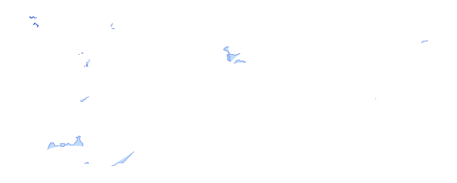

# wrl_admn_dis_ln_s0_un_pp

Vector · LineString

**Geometry:** LineString

## Description

World disputed boundary. Source: United Nations 2019

## Preview

## Technical metadata

| Field | Value |
| --- | --- |
| CRS | GEOGCS["WGS 84",DATUM["WGS_1984",SPHEROID["WGS 84",6378137,298.257223563,AUTHORITY["EPSG","7030"]],AUTHORITY["EPSG","6326"]],PRIMEM["Greenwich",0],UNIT["Degree",0.0174532925199433],AXIS["Longitude",EAST],AXIS["Latitude",NORTH]] |
| EPSG | — |
| Extent (minx, miny, maxx, maxy) | 20.826750, 43.146106, 20.923553, 43.267953 |
| Feature count | 100 |
| Layer name | wrl_admn_dis_ln_s0_un_pp |

## Attribute schema

| Column | Type |
| --- | --- |
| BDYTYP | int64 |
| ISO3CD | str |
| Shape_Leng | float64 |
| Shape__Len | float64 |

## Sample data

| BDYTYP | ISO3CD | Shape_Leng | Shape__Len |
| --- | --- | --- | --- |
| 99 |  | 3.9525 | 0.0 |
| 99 |  | 3.951965957 | 0.0 |
| 99 |  | 370.945358275 | 0.0 |
| 99 |  | 0.553529768 | 0.0 |
| 8 | SRB | 0.317400396367 | 39855.5005473 |
