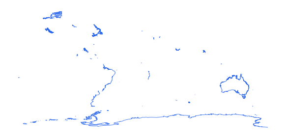

# wrl_elev_cst_ln_s0_un_pp

Vector · LineString

**Geometry:** LineString

## Description

World coastline. Source: United Nations 2019

## Preview

## Technical metadata

| Field | Value |
| --- | --- |
| CRS | GEOGCS["WGS 84",DATUM["WGS_1984",SPHEROID["WGS 84",6378137,298.257223563,AUTHORITY["EPSG","7030"]],AUTHORITY["EPSG","6326"]],PRIMEM["Greenwich",0],UNIT["Degree",0.0174532925199433],AXIS["Longitude",EAST],AXIS["Latitude",NORTH]] |
| EPSG | — |
| Extent (minx, miny, maxx, maxy) | 50.794159, 25.192888, 51.630832, 25.808556 |
| Feature count | 33359 |
| Layer name | wrl_elev_cst_ln_s0_un_pp |

## Attribute schema

| Column | Type |
| --- | --- |
| BDYTYP | int64 |
| ISO3CD | str |
| Shape_Leng | float64 |
| Shape__Len | float64 |

## Sample data

| BDYTYP | ISO3CD | Shape_Leng | Shape__Len |
| --- | --- | --- | --- |
| 0 | QAT | 0.0351260561032 | 3986.70278915 |
| 0 | QAT | 0.202189713366 | 24052.8245136 |
| 0 | QAT | 0.0618855532124 | 7309.27372235 |
| 0 | QAT | 0.509492208644 | 60340.7976017 |
| 0 | QAT | 0.859711693424 | 101832.367691 |
