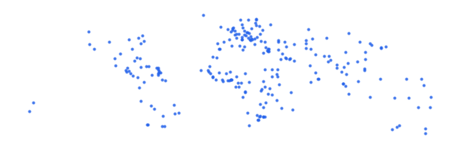

# wrl_stle_stl_pt_s0_naturalearth_pp

Vector · Point

**Geometry:** Point

## Description

World settlements. Source: Natural Earth Data 2022

## Preview

## Technical metadata

| Field | Value |
| --- | --- |
| CRS | GEOGCS["WGS 84",DATUM["WGS_1984",SPHEROID["WGS 84",6378137,298.257223563,AUTHORITY["EPSG","7030"]],AUTHORITY["EPSG","6326"]],PRIMEM["Greenwich",0],UNIT["Degree",0.0174532925199433],AXIS["Longitude",EAST],AXIS["Latitude",NORTH]] |
| EPSG | — |
| Extent (minx, miny, maxx, maxy) | 6.130003, -26.466667, 31.199997, 49.611660 |
| Feature count | 243 |
| Layer name | wrl_stle_stl_pt_s0_naturalearth_pp |

## Attribute schema

| Column | Type |
| --- | --- |
| SCALERANK | int32 |
| NATSCALE | int32 |
| LABELRANK | int32 |
| FEATURECLA | str |
| NAME | str |
| NAMEPAR | object |
| NAMEALT | object |
| NAMEASCII | str |
| ADM0CAP | int32 |
| CAPIN | str |
| WORLDCITY | int32 |
| MEGACITY | int32 |
| SOV0NAME | str |
| SOV_A3 | str |
| ADM0NAME | str |
| ADM0_A3 | str |
| ADM1NAME | str |
| ISO_A2 | str |
| NOTE | object |
| LATITUDE | float64 |
| LONGITUDE | float64 |
| POP_MAX | int64 |
| POP_MIN | int64 |
| POP_OTHER | int64 |
| RANK_MAX | int32 |
| RANK_MIN | int32 |
| MEGANAME | object |
| LS_NAME | str |
| MAX_POP10 | int64 |
| MAX_POP20 | int64 |
| MAX_POP50 | int64 |
| MAX_POP300 | int64 |
| MAX_POP310 | int64 |
| MAX_NATSCA | int64 |
| MIN_AREAKM | int64 |
| MAX_AREAKM | int64 |
| MIN_AREAMI | int64 |
| MAX_AREAMI | int64 |
| MIN_PERKM | int64 |
| MAX_PERKM | int64 |
| MIN_PERMI | int64 |
| MAX_PERMI | int64 |
| MIN_BBXMIN | float64 |
| MAX_BBXMIN | float64 |
| MIN_BBXMAX | float64 |
| MAX_BBXMAX | float64 |
| MIN_BBYMIN | float64 |
| MAX_BBYMIN | float64 |
| MIN_BBYMAX | float64 |
| MAX_BBYMAX | float64 |
| MEAN_BBXC | float64 |
| MEAN_BBYC | float64 |
| TIMEZONE | str |
| UN_FID | int32 |
| POP1950 | int64 |
| POP1955 | int64 |
| POP1960 | int64 |
| POP1965 | int64 |
| POP1970 | int64 |
| POP1975 | int64 |
| POP1980 | int64 |
| POP1985 | int64 |
| POP1990 | int64 |
| POP1995 | int64 |
| POP2000 | int64 |
| POP2005 | int64 |
| POP2010 | int64 |
| POP2015 | int64 |
| POP2020 | int64 |
| POP2025 | int64 |
| POP2050 | int64 |
| MIN_ZOOM | float64 |
| WIKIDATAID | str |
| WOF_ID | int64 |
| CAPALT | int32 |
| NAME_EN | str |
| NAME_DE | str |
| NAME_ES | str |
| NAME_FR | str |
| NAME_PT | str |
| NAME_RU | str |
| NAME_ZH | str |
| LABEL | object |
| NAME_AR | str |
| NAME_BN | str |
| NAME_EL | str |
| NAME_HI | str |
| NAME_HU | str |
| NAME_ID | str |
| NAME_IT | str |
| NAME_JA | str |
| NAME_KO | str |
| NAME_NL | str |
| NAME_PL | str |
| NAME_SV | str |
| NAME_TR | str |
| NAME_VI | str |
| NE_ID | int64 |
| NAME_FA | str |
| NAME_HE | str |
| NAME_UK | str |
| NAME_UR | str |
| NAME_ZHT | str |
| GEONAMESID | int64 |
| FCLASS_ISO | object |
| FCLASS_US | object |
| FCLASS_FR | object |
| FCLASS_RU | object |
| FCLASS_ES | object |
| FCLASS_CN | object |
| FCLASS_TW | object |
| FCLASS_IN | object |
| FCLASS_NP | object |
| FCLASS_PK | object |
| FCLASS_DE | object |
| FCLASS_GB | object |
| FCLASS_BR | object |
| FCLASS_IL | object |
| FCLASS_PS | object |
| FCLASS_SA | object |
| FCLASS_EG | object |
| FCLASS_MA | object |
| FCLASS_PT | object |
| FCLASS_AR | object |
| FCLASS_JP | object |
| FCLASS_KO | object |
| FCLASS_VN | object |
| FCLASS_TR | object |
| FCLASS_ID | object |
| FCLASS_PL | object |
| FCLASS_GR | object |
| FCLASS_IT | object |
| FCLASS_NL | object |
| FCLASS_SE | object |
| FCLASS_BD | object |
| FCLASS_UA | object |
| FCLASS_TLC | object |

## Sample data

| SCALERANK | NATSCALE | LABELRANK | FEATURECLA | NAME | NAMEPAR | NAMEALT | NAMEASCII | ADM0CAP | CAPIN | WORLDCITY | MEGACITY |
| --- | --- | --- | --- | --- | --- | --- | --- | --- | --- | --- | --- |
| 8 | 10 | 3 | Admin-0 capital | Vatican City |  |  | Vatican City | 1 |  | 1 | 0 |
| 7 | 20 | 0 | Admin-0 capital | San Marino |  |  | San Marino | 1 |  | 0 | 0 |
| 7 | 20 | 0 | Admin-0 capital | Vaduz |  |  | Vaduz | 1 |  | 0 | 0 |
| 6 | 30 | 8 | Admin-0 capital alt | Lobamba |  |  | Lobamba | 0 | Legislative and | 0 | 0 |
| 6 | 30 | 8 | Admin-0 capital | Luxembourg |  |  | Luxembourg | 1 |  | 0 | 0 |
